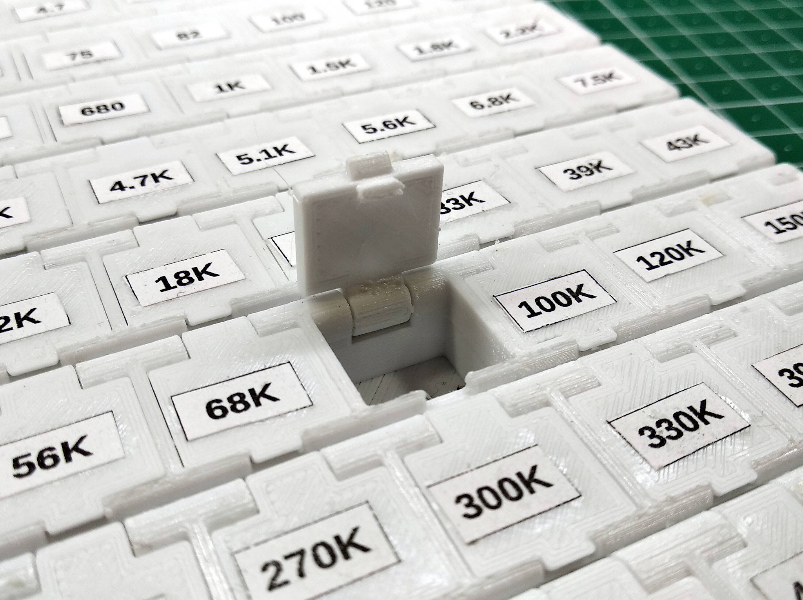

# SMD Component Storage

## Description

It is pretty common among hobbyists to use SMD components nowadays. These component are are cheap and let us to build
very compact devices.  

The problem is to store SMD components because they are very small and need appropriate storage boxes. Some useful boxes
can be found on AliExpress, but not always they satisfy end user's needs.

This project provides ready to use parametrized 3D modelled storage for SMD components. It contains STL files of some
ready to use boxes. Also, if you need other dimensions, you can adjust source 3D model in Autodesk Fusion 360.

## How To Use

- Open necessary [STL-file(s)](stl/) in your favourite slicer.
- Prepare model(s) for printing.
- Slice and print.

## How To Get Custom Sized Case

- Open [source 3D model](src/smd-box.f3d) in Fusion 360.
- Open "Parameters" dialog and set variables in "User Parameters" for your needs.
- Export STL models.
- Print.

## Example

You can find built examples [here](https://www.thingiverse.com/thing:3720450).

## Built With

- [Autodesk Fusion 360](https://www.autodesk.com/products/fusion-360/overview).

## Contributing

Please read [CONTRIBUTING.md](CONTRIBUTING.md) for details.

## Versioning

I use [SemVer](http://semver.org/) for versioning. For the versions available, see the
[tags on this repository](https://github.com/ashep/power-supply-case/tags).

## See also

- [Project on Thingiverse](https://www.thingiverse.com/thing:3720450).
- [Project on Hackster](https://www.hackster.io/ashep/smd-component-storage-761d4b).
 

## Authors

* [Oleksandr Shepetko](https://shepetko.com) -- initial work.

## License

This project is licensed under the MIT License. See the [LICENSE.md](LICENSE.md) file for details.
